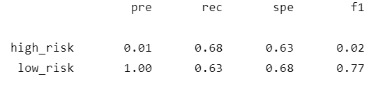
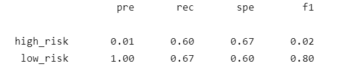
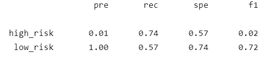
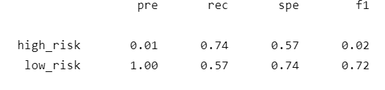
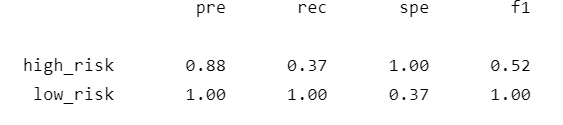
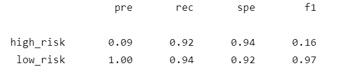

# Credit Risk Analysis

## Overview of the loan prediction risk analysis:

This analysis applies machine learning to assess credit risk. Using a credit card dataset from LendingClub, I tested six different machine learning models to predict credit risk (classifying as low-risk or high-risk). The different models all attempted to address the challenge of unbalanced classification in the dataset, as low-risk loans far outnumbers the high-risk loans. 

## Results:

### Oversampling Models

* Naive Random Oversampling:
  * Balanced Accuracy Score: 65%
  * Classification Report
     

* SMOTE
  * Balanced Accuracy Score: 63%
  * Classification Report
    

### Undersampling Model
* Cluster Centroids 
  * Balanced Accuracy Score: 65%
  * Classification Report
   

### Combination Model
* SMOTEENN
  * Balanced Accuracy Score: 65%
  * Classification Report
   
  
  
### Ensemble Models 
* Balanced Random Forest Classifier 
  * Balanced Accuracy Score: 68%
  * Classification Report
   
 
 
* Easy Ensemble AdaBoost Classifier 
  * Balanced Accuracy Score: 92%
  * Classification Report
    

## Summary:

The balanced accuracy score of each model is not a very useful performance metric here, as we are interested in detecting the minority class of high-risk loans; even the highest accuracy score of 92% has a very low F1 score for the high-risk class. Therefore, we should look to the F1 score of the high-risk class for each model. The **Balanced Random Forest Classifier** has the best F1 score at 0.52, far out performing the other models. This F1 score is composed of a relatively high precision (88% of the loans classified as high-risk were indeed high-risk) but a much lower recall (the model only classified 37% of the high-risk loans correctly). 
 

## Recommendation:
Though we found a model that outperforms the others, it is only comparitively successful. A F1 score of 0.52 is too low for practical use as a reliable predictor. 
